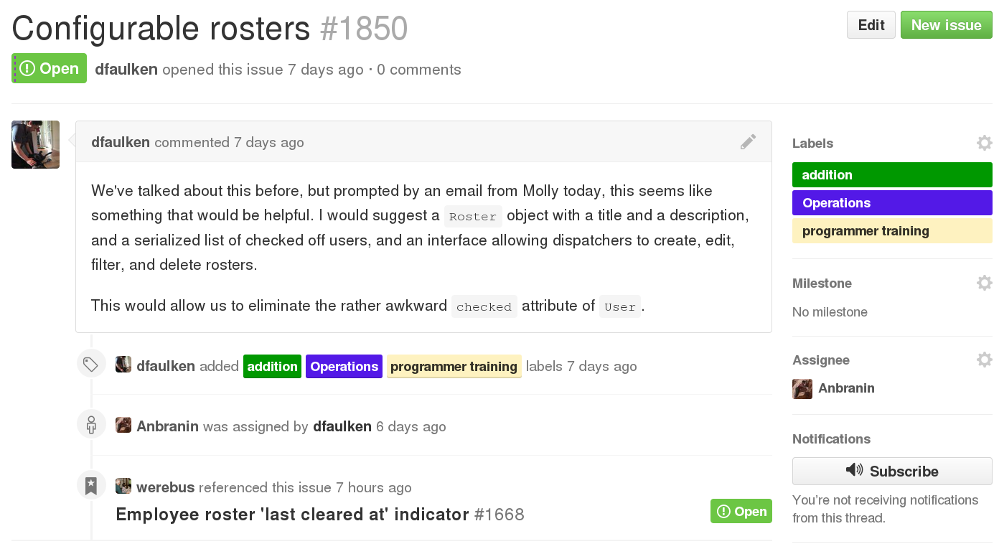

<!SLIDE >
# Issues #

~~~SECTION:notes~~~
This is an issue on our main Rails app.  You can see that we've
assigned a few labels including the "programmer training" one, you'll
also see that it's assigned to a particular programmer, and that it's
been mentioned from another issue.
~~~ENDSECTION~~~
