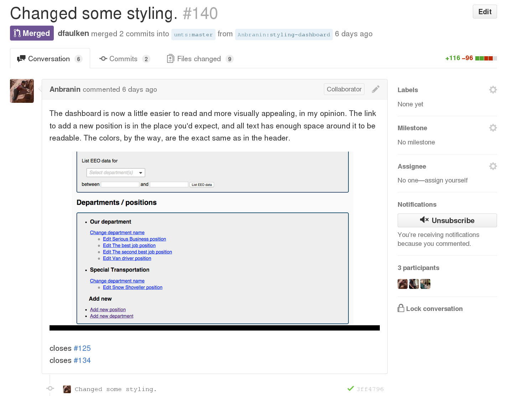
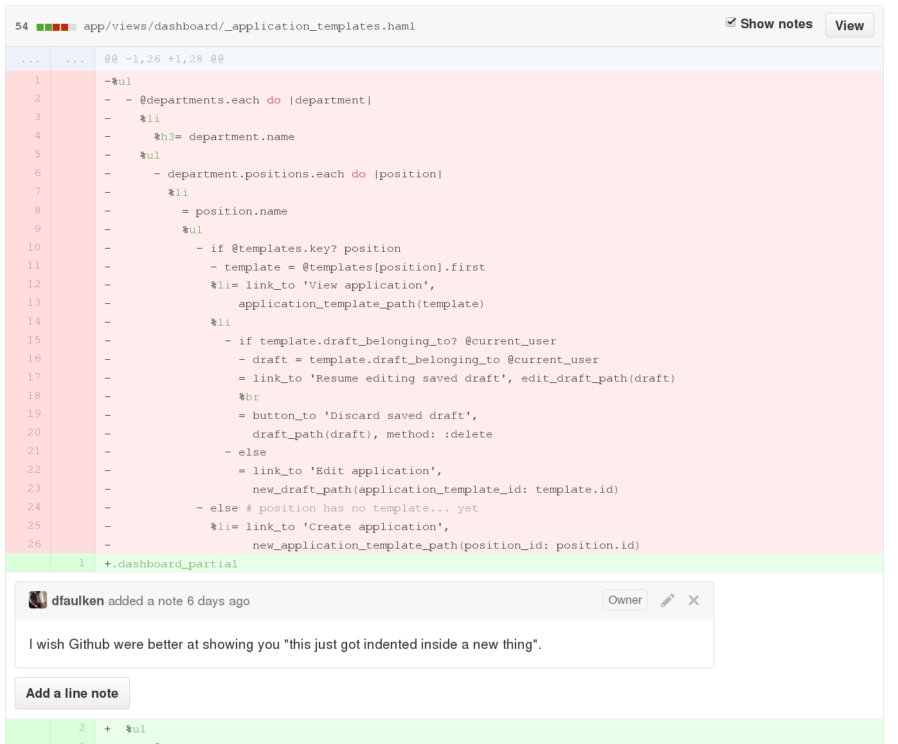

<!SLIDE >
# Pull Requests #

~~~SECTION:notes~~~
A PR is really just an issue that's connected to a "desired" merge
commit.

Here you can see the beginning of a PR discussion.  Some things to note:

*  The programmer has attached a screenshot
*  She also added in the comment some related issues that will be closed
   by this PR. Those issues will be closed *when* this PR is merged.
*  You can see the name of the branch that was merged, note that it is
   from Anbranin's fork of the app
*  At the bottom is one of the commits in the branch.  Note the
   checkmark; Dave will talk about what that is.
~~~ENDSECTION~~~

<!SLIDE >
# Pull Request Diffs #

~~~SECTION:notes~~~
This is a portion of the diff of that PR.  Notice that Dave added an
in-line comment on that commit.

We use PRs as our code-review process.  In general, someone else looks
at the code before merging it into "master" amounting to a
peer-reviewed process.
~~~ENDSECTION~~~
